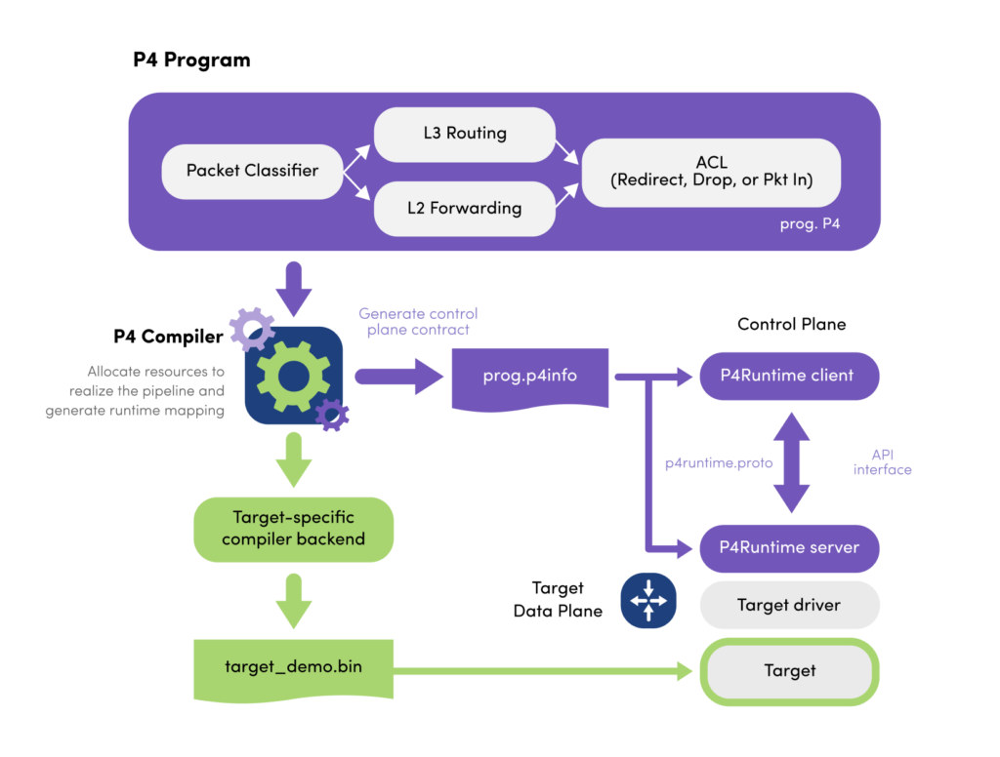

# P4 路由器实验：控制平面

在本节中，实验者需要熟悉 P4 控制平面的基本概念和操作流程，包括 P4 程序的编译、数据平面程序的加载、以及如何通过控制平面下发表项来控制数据平面行为。

在本节中，实验者需要完成 `p4-tutorial` 中 **P4Runtime and the Control Plane** 下的两个作业：

* P4Runtime
* Flowcache

通过这些作业，实验者将熟悉 P4 控制平面的基本操作流程，包括读取 P4Info 文件、理解表、动作和字段的对应关系，以及使用 P4Runtime 进行表项插入、修改、删除等操作。完成这些练习后，实验者可以掌握控制平面操作与数据平面行为的对应关系，为后续上手 `Tofino` 硬件平台做准备。

## P4 程序编译

P4程序首先由 P4 编译器进行编译。编译器的职责是把用户编写的 P4 源代码翻译成两类输出（以 `advanced_tunnel.p4` 为例）：

| 输出文件                                                                    | 作用                                                                                                              |
| ----------------------------------------------------------------------- | --------------------------------------------------------------------------------------------------------------- |
| **target-specific data plane binary / JSON**（`target_demo.bin`） | 针对具体硬件/软件目标（如 BMv2、Tofino）生成的数据平面转发表、动作执行代码等，实现数据包的实际处理逻辑。加载到交换机的数据平面运行。                                        |
| **P4Info 文件**（`prog.p4info`）                      | 与目标无关（target-independent）的控制平面接口描述。包含所有表、动作、字段、计数器、寄存器等的 ID、名称、参数信息。供控制平面程序（gRPC 客户端、`bfrt_python`、ONOS 等）调用时使用。 |

## P4 程序加载

在运行时，需要将数据平面程序加载到交换机：

| 目标                     | 加载方式                                                                                   |
| ---------------------- | -------------------------------------------------------------------------------------- |
| **BMv2**        | 运行 `simple_switch` 时通过 `-j xxx.json` 参数加载 JSON。                    |
| **Tofino ASIC** | 使用 Barefoot/Intel SDE 中的 `bf_switchd` 启动交换机并加载编译好的二进制 pipeline 配置文件（`*.bin`）。 |

## 数据平面驱动与 P4Runtime
不同目标的 SDK 驱动负责把编译好的 pipeline 加载到硬件或软件交换机，并在其之上暴露控制平面接口。

在 BMv2 上，运行 `simple_switch_grpc` 时，BMv2 自带了一个 **P4Runtime Server**，它直接监听 **gRPC** 端口。控制平面程序（Python、C++ 客户端）通过 **P4Runtime API** 与之交互，下发表项、读状态。

在 Tofino ASIC 上，Barefoot/Intel 的 SDE 提供了 `BF Runtime (bfrt)` 和可选的 **P4Runtime Server**。控制平面可以：

* 用 `bfrt Python` / C++ SDK 直接调用厂商接口
* 用 P4Runtime 客户端通过 gRPC 调用标准化 API。

**P4Runtime** 是一个厂商无关、gRPC/Protobuf 定义的标准接口，用来：

* 让控制平面程序根据 P4Info 文件理解 pipeline 结构；
* 在不同目标之间统一“插入/修改表项、读写计数器、`packet_in`/`packet_out`”等操作。

## P4 控制平面调用 API

控制平面程序通常基于 SDK 或 P4Runtime 客户端库工作。

### P4Info 文件

P4 编译器在生成目标特定的数据平面程序（BMv2 JSON / Tofino 二进制）时，同时会生成一个 **P4Info 文件**。  
这个文件是 **与目标无关的控制平面接口描述**，包含：

* 所有表（tables）、动作（actions）、匹配字段（match fields）的名称与 ID  
* 动作参数、计数器、寄存器、元数据等定义  
* 控制平面与数据平面交互时需要的全部符号信息

控制平面程序通过读取 P4Info 文件，才能知道“有哪些表、字段、动作可以操作”。

### 控制平面下发表项

控制平面通常基于 SDK 或 P4Runtime 客户端库下发表项，基本流程如下：

1. **加载 P4Info**  
   读取 `p4info` 文件，解析表、动作和字段 ID。

2. **建立与交换机的会话**  
   通过 gRPC / runtime 接口连接 BMv2 或硬件交换机。

3. **下发表项/执行操作**  

    * 插入、修改、删除表项  
    * 配置动作参数、计数器、寄存器  
    * 下发多播组、动作组  
    * 接收或发送数据包上报（`packet_in` / `packet_out`）

通过这种方式，控制平面就能在运行时动态地操控数据平面的转发行为。
