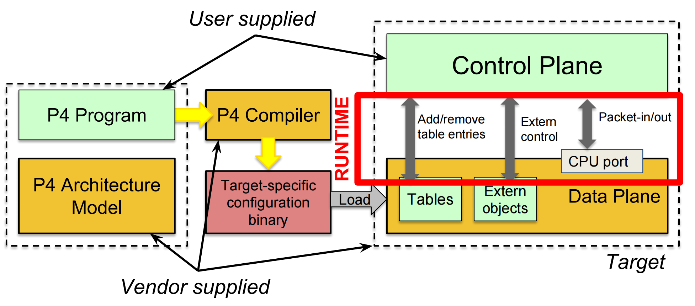
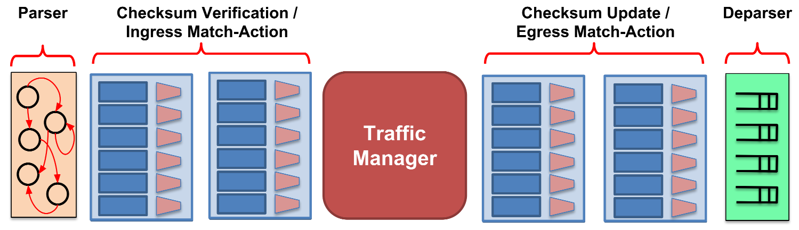
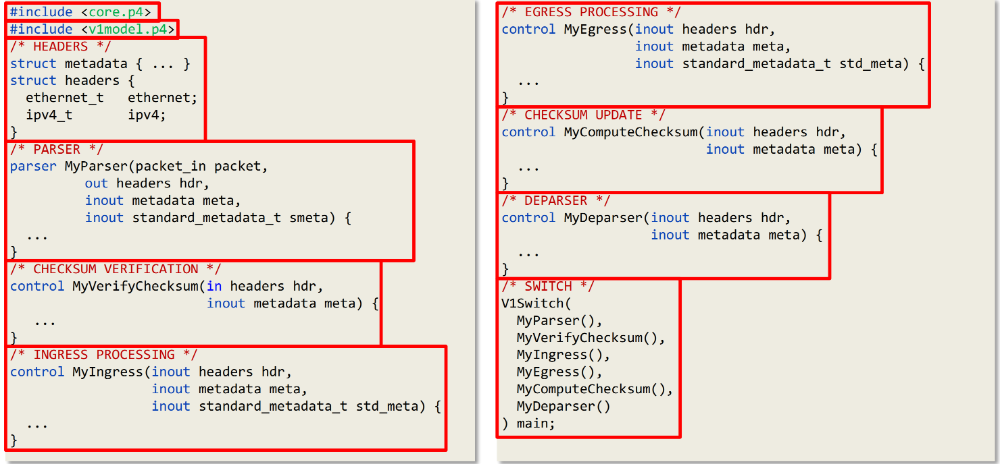

# P4 路由器实验：数据平面

在本节中，实验者需要熟悉 P4 数据平面的基本概念和编程模型，包括 P4 程序的架构、解析器设计、匹配-动作流水线编程，以及基础转发和隧道功能的实现。

在本节中，实验者需要完成 `p4-tutorial` 中 **Introduction and Language Basics** 下的两个作业：

* Basic Forwarding
* Basic Tunneling

通过这些作业，实验者将熟悉 P4 数据平面的基本编程模型，包括解析器状态机设计、匹配-动作表定义、头部元数据操作，以及基础转发和隧道封装功能的实现。完成这些练习后，实验者可以掌握数据平面程序的结构与流水线处理逻辑，理解数据包解析、转发决策和封装解封装的核心机制，为后续学习更复杂的网络功能和控制平面交互打下基础。

## P4 环境安装
请实验者参考 `p4-tutorial` 中的 **Obtaining required software** 部分下载、安装虚拟机镜像。

> 以下部分提供的是使用 `Vagrant` 配置的终端型虚拟机，未支持图形化界面 (Lab 1.2 需要)
> 推荐参考原仓库安装 `Virtual Box` 直接下载相应镜像

### 安装虚拟机环境
以下脚本完成这些内容：

* 下载 `Vagrant` 和 `libvirt`
* 下载 vagrant 插件: `vagrant-rsync-back`
	* `vagrant rsync` 指令将宿主机上的文件夹覆盖到虚拟机上
	* `vagrant rsync-back` 指令将虚拟机上的文件夹覆盖回宿主机
* 将用户添加到 `libvirt` 和 `kvm` 组中

``` bash
#!/bin/bash

echo 'Setup up'

echo 'Update apt dependencies'
sudo apt-get update -y
sudo apt install libelf-dev python-dev -y

echo 'Installing vagrant and libvirt...'
curl -O https://raw.githubusercontent.com/vagrant-libvirt/vagrant-libvirt-qa/main/scripts/install.bash
chmod a+x ./install.bash
./install.bash || exit 1
rm ./install.bash

echo 'Installing vagrant plugins...'
vagrant plugin install vagrant-rsync-back

echo 'Enable the ports used by nfs...'
# 192.168.121.x
if command -v ufw >/dev/null 2>&1; then
	sudo ufw allow from 192.168.121.0/24 || echo "Fail to set ufw rule..."
else
	echo "Please do remember to allow the connections from the private network of VM in your firewall."
fi

echo 'Grant the user privilege... '
sudo usermod -aG kvm "$USER"
sudo usermod -aG libvirt "$USER"

echo 'Set up done.'
echo 'ATTENTION: Please exit and re-login your account to make the privilege take effect.'
echo 'Then run "vagrant up" and "vagrant ssh" to connect to the guest.'
```

### 启动虚拟机
请新建一个文件夹，例如 `mkdir p4 && cd p4`，在当前文件夹下:
* `git clone https://github.com/p4lang/tutorials.git`
* 创建 `Vagrantfile`:

```
Vagrant.configure("2") do |config|

  config.vm.box = "crystax/ubuntu2404"

  config.vm.synced_folder ".", "/vagrant", disabled: true
  config.vm.synced_folder "./tutorials", "/home/vagrant/tutorials", type: 'rsync'

  config.ssh.insert_key = true
  config.ssh.username = 'vagrant'
  config.ssh.password = 'vagrant'

  config.vm.network "private_network", ip: "192.168.121.5"
  config.vm.define "vm-p4"

  config.vm.provider:"libvirt" do |lv|
      lv.memory = 8192
      lv.cpus = 8
    end
  
end
```

以上 `Vagrantfile` 有如下功能：

* 创建一个 `ubuntu 24.04` 的虚拟机
* 创建 `tutorials` 文件夹宿主机和虚拟机之间的映射，可以进行 `rsync` 和 `rsync-back` 操作
* 设定虚拟机名称 `vm-p4`
* 设定虚拟机 cpu 数和内存大小

通过 `vagrant ssh` 登录虚拟机

### 安装 P4 环境
进入虚拟机后，运行如下指令 (注: 运行以下脚本需要使虚拟机能科学上网)：

``` bash
mkdir src
cd src
../tutorials/vm-ubuntu-24.04/install.sh |& tee log.txt
```

之后通过 `../tutorials/vm-ubuntu-24.04/clean.sh` 减少内存使用

以上过程大概需要 1~2 个小时完成，完成后退出虚拟机重进，进入 `tutorials/exercises/basic` 文件夹，进行 `make run`，看是否正常，正常情况出现下面终端显示:

```
mininet>
```

## P4 基础概念
### 核心组件说明

| 组件          | 功能描述                       |
| ----------- | -------------------------- |
| **BMv2**    | P4 软件交换机实现，提供可编程数据平面       |
| **p4c**     | 官方 P4 编译器，将 P4 代码编译为目标特定配置 |
| **Mininet** | 轻量级网络仿真环境，用于测试 P4 程序       |

### P4 编程模型架构



### V1Model 架构详解

V1Model 是 BMv2 Simple Switch 常用的架构，采用经典的"匹配-动作"流水线设计。

#### 数据处理流程



#### 核心组件功能

| 组件                           | 功能描述                        | 可编程性             |
| ---------------------------- | --------------------------- | ---------------- |
| **Parser（解析器）**              | 将原始数据比特流解析为结构化数据包和元数据       | 程序员定义解析逻辑和头部解析顺序 |
| **Ingress Pipeline（入端口流水线）** | 核心匹配-动作处理场所，执行路由查询、ACL检查等操作 | 完全可编程，定义表查询和动作执行 |
| **Traffic Manager（流量管理器）**   | 连接入端口和出端口流水线，处理队列缓冲和组播复制    | 通常为固定功能，不可编程     |
| **Egress Pipeline（出端口流水线）**  | 数据包发出前的最终处理，可进行出端口方向过滤和计数   | 完全可编程            |
| **Deparser（重组器）**            | 将处理后的头部数据重新序列化为字节流          | 程序员定义输出数据包结构     |

#### P4 程序模板（V1Model）



