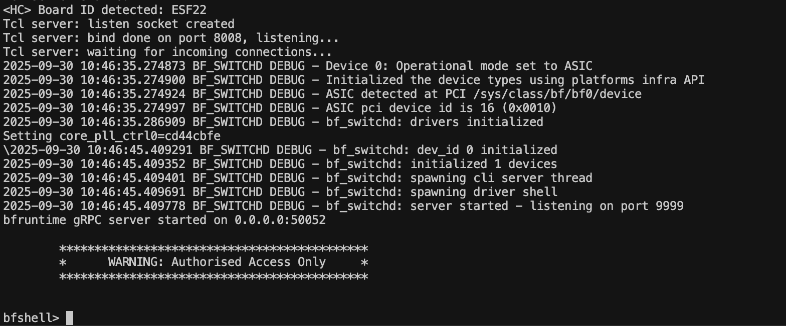

# Tofino 交换机基础实验: Simple Forward

在本节中，实验者将学习如何在真实 Tofino 芯片交换机上进行 L2/L3 Forwarding 实验，熟悉硬件架构和适配 Tofino 的 P4 编程方法，实现从仿真环境到真实硬件的过渡

在本节中，将以 `simple_forward`程序为例，帮助实验者将了解如何在 Tofino 芯片交换机上编译、运行 P4 程序，如何通过 `bfshell` 下发表项等。

在 `simple_forward` 程序中，交换机实现了基于端口号的 Forwarding 功能，实验者可以通过 `bfshell` 手动下发表项，实现两个端口之间的互通

```
action ai_forward(portid_t egress_port){
    ig_tm_md.ucast_egress_port = egress_port;
}

table ti_forward{
    key = {
        ig_intr_md.ingress_port: exact;
    }
    actions = {
        ai_forward;
        ai_drop;
    }
    size = 1024;
    default_action = ai_drop;
}
```

以下部分讲解如何通过 `bfshell` ⼿动下发表项

## 通过 `bfshell` ⼿动下发表项
### 程序编译
可参考学习 Makefile 中的编译指令

``` bash
# 登录 root 用户
cd ~/simple_forward
make
```

编译好后的程序会在 `/root/bf-sde-9.13.0/build/p4-build/tofino/simple_forward/`

### 程序运行

``` bash
/root/bf-sde-9.13.0/run_switchd.sh -p simple_forward
```

运行截图如下，出现 `bfshell>` 证明成功运行



### 端口开启
运行以上指令进入 `bfshell` 后，进入 `ucli` 模式开启端口：

```
bfshell> ucli
Starting UCLI from bf-shell 

Cannot read termcap database;
using dumb terminal settings.
bf-sde> xcvr_pres_ignore 9/- 1
bf-sde> xcvr_los_ignore 9/- 1
bf-sde> pm
bf-sde.pm> port-add 9/0 10G NONE
bf-sde.pm> port-add 9/1 10G NONE
bf-sde.pm> port-enb 9/0
bf-sde.pm> port-enb 9/1
bf-sde.pm> show
-----+----+---+----+-------+----+--+--+---+---+---+--------+----------------+----------------+-
PORT |MAC |D_P|P/PT|SPEED  |FEC |AN|KR|RDY|ADM|OPR|LPBK    |FRAMES RX       |FRAMES TX       |E
-----+----+---+----+-------+----+--+--+---+---+---+--------+----------------+----------------+-
9/0  |23/0|132|3/ 4|10G    |NONE|Au|Au|YES|ENB|UP |  NONE  |               5|               0| 
9/1  |23/1|133|3/ 5|10G    |NONE|Au|Au|YES|ENB|UP |  NONE  |               2|               0| 
bf-sde.pm> 
```

### 表项下发
使用 `exit` 指令退回⾄ `bfshell`，运⾏ `bfrt_python`，使用 `bfrt.info()` 查看当前表项：

```
bf-sde.pm> exit

bfshell> bfrt_python
cwd : /root/simple_forward

We've found 1 p4 programs for device 0:
simple_forward
Creating tree for dev 0 and program simple_forward

Devices found :  [0]
Python 3.10.9 (main, Oct  6 2024, 07:19:08) [GCC 9.4.0]
Type 'copyright', 'credits' or 'license' for more information
IPython 7.31.1 -- An enhanced Interactive Python. Type '?' for help.

bfrt_python> bfrt.info()
Tables under this node:
Full Table Name                          Type                        Usage      Capacity
---------------------------------------  --------------------------  -------  ----------
tbl_dbg_counter                          DBG_CNT                     192             192
pipe.snapshot.ingress_trigger            SNAPSHOT_TRIG               n/a              12
pipe.snapshot.ingress_liveness           SNAPSHOT_LIVENESS           n/a               0
pipe.snapshot.ingress_data               SNAPSHOT_DATA               12               12
pipe.snapshot.egress_trigger             SNAPSHOT_TRIG               n/a              12
pipe.snapshot.egress_liveness            SNAPSHOT_LIVENESS           n/a               0
pipe.snapshot.egress_data                SNAPSHOT_DATA               12               12
pipe.snapshot.cfg                        SNAPSHOT_CFG                0                12
pipe.SwitchIngressParser.$PORT_METADATA  PORT_METADATA               0               288
pipe.SwitchIngress.ti_forward            MATCH_DIRECT                0              1024
......
```

可以看到 `pipe.SwitchIngress.ti_forward` 是我们数据平⾯程序的表

> `bfrt_python` 使用 tips:
> 想查看的表后加 `?` 可以查看针对该表可以进⾏什么操作，例如 `bfrt?`

接下来我们重点关注 `pipe.SwitchIngress.ti_forward`

```
bfrt_python> tbl = bfrt.simple_forward.pipe.SwitchIngress.ti_forward
bfrt_python> tbl.info()
......
bfrt_python> tbl?
......
bfrt_python> tbl.add_with_ai_forward?
Help on method add_with_ai_forward in module bfrtcli:

add_with_ai_forward(ingress_port=None, egress_port=None, pipe=None, gress_dir=None, prsr_id=None) method of bfrtcli.BFLeaf instance
    Add entry to ti_forward table with action: SwitchIngress.ai_forward
    
    Parameters:
    ingress_port                   type=EXACT      size=9  default=0
    egress_port                    type=BYTE_STREAM size=9  default=0
```

经过 `tbl?` 我们查询到 `add_with_ai_forward` 是一个添加 `ai_forward` 动作表项的下发接口

通过以下指令即可下发两个端口的表项：

```
tbl.add_with_ai_forward(
    ingress_port=132,
    egress_port=133
)
tbl.add_with_ai_forward(
    ingress_port=133,
    egress_port=132
)
```

以上即为手动下发表项的参考，更快速、更复杂的下发表项的办法请参考提供的 `simple_forward` 示例程序
