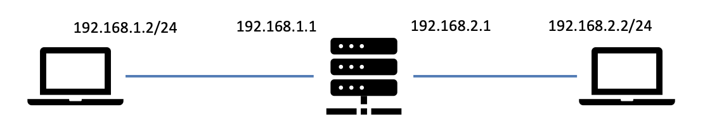

# P4 实验：Tofino 交换机转发程序

在本节实验中，实验者将通过 Tofino 可编程交换机熟悉 P4 数据平面与控制平面的协作机制，理解如何通过手动下发表项实现基本的二层与三层转发功能，掌握交换机在数据平面和控制平面的包处理逻辑。

## 实验环境

| 组件             | 功能描述                                               |
| -------------- | -------------------------------------------------- |
| **Tofino 交换机** | 硬件可编程交换芯片，运行编译后的 P4 数据平面程序                         |
| **控制平面**       | 负责下发表项，可通过 BfRt API 实现 |
| **Host A**     | 模拟网络节点 A，配置 IP `192.168.1.2/24`，网关 `192.168.1.1`   |
| **Host B**     | 模拟网络节点 B，配置 IP `192.168.2.2/24`，网关 `192.168.2.1`   |

网络拓扑如下：

## 实验目标

* 理解 Tofino 数据平面的基本转发逻辑；
* 熟悉控制平面表项下发流程
* 掌握 ARP 解析与 IP 分组转发机制
* 通过表项配置实现 A 与 B 的互通

## 实验内容

### 连通性测试场景

| 主机    | IP 地址          | 网关地址        |
| ----- | -------------- | ----------- |
| **A** | 192.168.1.2/24 | 192.168.1.1 |
| **B** | 192.168.2.2/24 | 192.168.2.1 |

实验者需实现以下通信流程：

* 从主机 `A` 执行 `ping 192.168.2.2`
* 确保数据平面能够正确处理 `ARP` 报文和 `IP` 分组
* 确认主机 `B` 能够正确收到并回复 `ICMP Echo Request`

### 报文交互与处理流程

#### ARP 请求与响应流程

主机 `A` 的行为：

1. `A` 发送 `ICMP` 时，发现目的地址 `192.168.2.2` 不在同一子网，故使用默认路由，向默认网关发送；
2. 根据默认网关配置，`A` 向网关地址 `192.168.1.1` 发送 `ARP Request`，报文内容：询问 `“Who has 192.168.1.1? Tell 192.168.1.2”`。
3. `A` 收到 `ARP Reply` 后，将网关 `MAC` 加入 `ARP` 缓存

Tofino 交换机的行为：

1. 与 `A` 相连的端口收到该 `ARP Request`；
2. 交换机根据控制平面下发的端口配置（`IP` 与 `MAC` 地址），对接收到的 `ARP Request` 进行修改，将其转换为对应的 `ARP Reply` 并返回给主机 `A`。

#### ICMP Echo Request 与 Reply 流程

1. `A -> Switch`：`A` 发送 `ICMP Echo Request` 到交换机，目的 `MAC` 为网关 `MAC`。
3. `Switch -> B`：交换机修改以太网头部，设置正确的源 `MAC` 和目的 `MAC`，发送 `ICMP Echo Request` 给 `B`。
    * 解析 `IP` 分组；
    * 查询转发表（控制平面预先下发），转发到连接 `B` 的端口；
    * 若目的 `MAC` 地址未知，发送 `ARP Request` 询问 `B` 的 `MAC` 地址；
    * 修改以太网头部，设置正确的源 `MAC` 和目的 `MAC`。
4. `B -> Switch`：`B` 收到 `ICMP Echo Request`，回复 `ICMP Echo Reply` 给交换机。
5. `Switch -> A`：交换机收到 `ICMP Echo Reply`，查询转发表，修改以太网头部，发送给 `A`。

注意：

* 实验中无需实现动态路由算法，只需由控制平面直接下发表项即可。
* 交换机端口配置的 `IP` 与 `MAC` 地址由控制平面预先设置，在数据平面中对应存储端口相关信息的 `meta data` 为：

| `meta_data` | 信息类型 |
| -- | ------------------------------- |
| `ig_md.port_ip`   | `ingress` 端口 `IP`   |
| `ig_md.port_mac`  | `ingress` 端口 `MAC`  |
| `eg_md.port_ip`   | `egress` 端口 `IP`   |
| `eg_md.port_mac`  | `egress` 端口 `MAC`  |

### 不同平面职责划分

#### 数据平面

数据平面程序负责解析和处理收到的报文，主要职责包括：

* 解析以太网、`ARP` 和 `IP` 分组；
* 根据控制平面下发的表项进行匹配和转发决策；
* 处理 `ARP` 请求与应答报文；
* 执行网关功能，转发 `IP` 分组。

#### 控制平面

控制平面程序负责下发表项，主要职责包括：

* 配置端口的 `IP` 地址与 `MAC` 地址；
* 配置静态转发表，实现 `A `与 `B` 之间的互通；

思考：从与 `B` 连通的端口转发出去的报文，是否每次都需要发送 `ARP` 请求查询 `B` 的 `MAC` 地址？如果不需要，控制平面应如何下发表项以避免频繁发送 `ARP` 请求？数据平面需要做哪些修改以支持该功能？

## 实验验证

| 步骤 | 验证方式                            | 期望结果                               |
| -- | ------------------------------- | ---------------------------------- |
| 1  | 在 `A` 与 `B` 分别抓包（`tcpdump`） | 可看到 ARP Request/Reply、ICMP Echo 报文                      |
| 2  | `A` 执行 `ping Host B`            | 可以连通 |

## 补充内容

在本实验中，主机 `A` 和主机 `B` 位于不同的子网。要实现 `A` 与 `B` 的通信，必须通过 `网关 (Gateway)` 转发。交换机在本实验中扮演网关的角色。

为便于理解，建议同学们参考以下 RFC 文档

| 主题                  | RFC 编号                                                    |
| ------------------- | --------------------------------------------------------- | 
| **ARP（地址解析协议）**     | [RFC 826](https://datatracker.ietf.org/doc/html/rfc826)   | 
| **ICMP（互联网控制消息协议）** | [RFC 792](https://datatracker.ietf.org/doc/html/rfc792)   |
| **IPv4**     | [RFC 791](https://datatracker.ietf.org/doc/html/rfc791)   | 
| **子网与路由概念**         | [RFC 950](https://datatracker.ietf.org/doc/html/rfc950)   | 
| **网关与路由选择**         | [RFC 1812](https://datatracker.ietf.org/doc/html/rfc1812) | 

