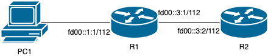

## 网络拓扑


在 TANLabs 提交后，会在实验室的实验网络下进行真机评测。你的软件会运行在树莓派上，和平台提供的机器组成如下的拓扑：



这一阶段，PC1 和 R2 由 TANLabs 自动配置和提供，你代码所运行在的树莓派处于 R1 的位置。

初始状态下，PC1 没有 IPv6 地址，也没有路由。在 R2 上配置了初始的 IPv6 地址 `fd00::3:2/112` 和如下的路由：

```text
fd00::1:0/112 via fd00::3:1 dev r2r1
fd00::3:0/112 dev r2r1 scope link
```

R1 负责为 PC1 分配动态的 IP 地址 `fd00::1:2/112`。R1 配置了静态的直连路由和默认路由。

## 检查内容

评测时 TANLabs 将会自动逐项检查下列内容：

1. 配置网络拓扑，在 R1 上运行定义了 `ROUTER_R1` 的 DHCPv6 服务器程序。
2. （35% 分数）测试 ICMPv6 Router Solicitation 处理：在 PC1 上运行 `rdisc6 pc1r1`，可以获取正确的信息。
3. （45% 分数）测试 DHCPv6 获取 IP 地址：在 PC1 上运行 `dhcpcd -6 -1 -B -C resolv.conf -d pc1r1`，能否成功获取动态 IPv6 地址。
4. （10% 分数）测试 ping：在 PC1 上运行 `ping fd00::3:2`，能否联通。
5. （10% 分数）测试转发性能：在 R2 上运行 `iperf3 -s`，在 PC1 上运行 `iperf3 -c fd00::3:2 -O 5 -P 10`，按照 Bitrate 给出分数，测试转发的效率。

代码量：实现 ICMPv6 处理约 70 行，实现 DHCPv6 协议约 120 行。

设转发性能为 $s$，所有同学中转发的最高性能为 $s_{max}$，则性能分数 $S$ 为：

$$
S = S_{total} \times e^{c \times (s/s_{max}-1)}
$$

其中 $c$ 为未知常数。由于性能会计入分数，请在通过所有功能测试后，检查一下是否删除了不必要的影响性能的调试代码。

??? warning "容易出错的地方"

    1. ICMPv6 构造时出错；
    2. DHCPv6 Option 构造出错，包括 Code，Length 等等字段；
    3. 目的 MAC 地址出错。

??? example "可供参考的例子"

    实际上，当你通过有线网连接清华校园网的时候，就需要通过 DHCPv6 协议获取动态的 IPv6 地址。你可以打开 Wireshark 进行抓包，然后通过有线连接到校园网，就可以看到 ICMPv6 以及 DHCPv6 的整个工作流程。

??? question "如何提升转发性能？"

    你可以按照代码的框架进行分析，在测试转发性能的时候，代码中哪些部分的执行次数最多，然后估计哪些部分的占用时间最长，然后针对这部分进行优化。

!!! tips "这个实验是怎么设计出来的？"

    设计这个实验，是为了让同学能够对家庭网络和学校网络如何工作有一个更深刻的认识。因此设计了三个网络设备：PC1，R1 和 R2，其中 PC1 对应同学自己的电脑，R1 对应家中的无线路由器，R2 对应运营商的路由器。R1 负责给 PC1 分配动态 IPv6 地址，然后将默认路由指向它的上游，也就是 R2。这和家中的网络拓扑是比较相似的，希望能让你回到家以后，可以学以致用，学会管理好自己家的网络。

    对于如何测试路由器的功能，也是采用了网络中常见的手段：ping，iperf 等等。ping 就是考察了路由表的正确性和转发功能；iperf 则是让同学对网络性能有一个概念，并且知道代码中哪些部分对性能影响大，哪些部分影响不大。至于 rdisc6 和 dhcpcd 则是专门针对 dhcpv6 而采用的，前者会发出 ICMPv6 Router Solicitation，然后显示出收到的 ICMPv6 Advertisement，而后者就是一个 DHCPv6 Client。

    这一阶段还希望大家理解和掌握网络模拟和调试的一些方法和工具：wireshark 和 netns。首先是希望同学掌握网络中的调试方法，之后在遇到网络不通的时候，不再是毫无方向地尝试各种方法，而是按照一定的思路，查看网络各处的状态，排除出问题所在。其次是希望同学接触一些比较先进的网络技术，比如 netns，可以在 linux 环境中模拟各种各样的网络，也可以让大家了解常见的容器技术是如何实现网络隔离的。如果同学不感兴趣具体原理，也可以直接用提供好的脚本来搭建基于 netns 的网络环境。