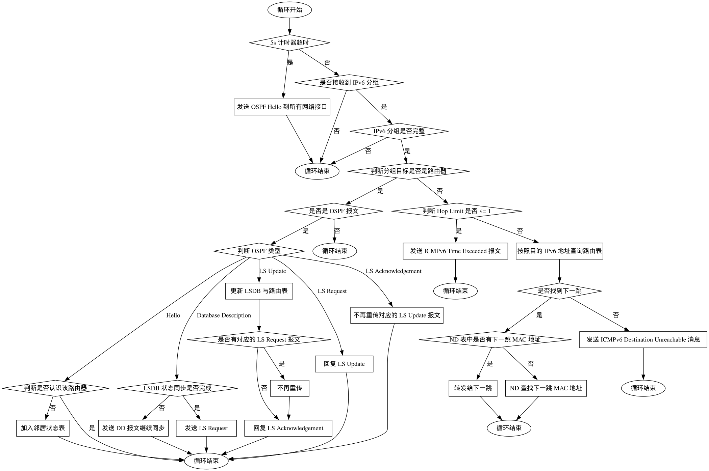

## OSPF 路由器

一个 OSPF 协议的路由器需要支持如下的功能：

1. 发现邻居 OSPF 路由器，保持 Link State Database 同步
2. 根据 Link State Database，通过 Dijkstra 最短路算法计算路由表
3. 按照动态计算得到的路由表，进行 IPv6 分组的转发

## 协议理解

为了方便实验者理解，这里简要介绍了一下本实验中 OSPF 协议的流程，详细内容请参见 [RFC 2328: OSPF Version 2](static/rfc2328.html) 及 Andrew S. Tanenbaum 等教授所撰写的《Computer Networks, 6th Edition》《计算机网络（第 6 版）》的第 5.2.5 节 Link State Routing（链路状态路由算法）和第 5.7.6 节 OSPF—An Interior Gateway Routing Protocol（OSPF——域内路由协议）。

OSPF 是一种链路状态路由协议，每个 OSPF 路由器都维护一个链路状态数据库（Link State Database，LSDB），其中包含了网络中所有路由器、子网及其连接关系的信息，具体表现为一个个的链路状态通告（Link State Advertisements，LSA）条目。路由器之间通过链路状态更新（Link State Update，LS Update）报文来同步这些信息。每个路由器使用链路状态信息计算路由表，完成分组转发。

在本实验中，我们只有一个区域 Area 0，并将路由器之间的网络简化为点到点网络（Point-to-Point networks），使用到的 LSA 只有两种：Router-LSA 和 Intra-Area-Prefix-LSA。Router-LSA 用来描述路由器之间的链路信息，Intra-Area-Prefix-LSA 用来描述路由器到子网的链路信息。计算路由表时，只需要先根据 Router-LSA 算出到所有路由器的最短路，再根据 Intra-Area-Prefix-LSA 计算出到每个子网的最短路，然后计算下一跳并插入路由表即可。

一旦路由器启动，其便会每隔一定时间向外发送 Hello 报文，描述自身的所有邻居（Neighbor）。当路由器收到一个 Hello 报文后，其便会在收报文的接口上开始维护这个报文的发送者对应的邻居数据结构（Neighbor data structure），其中存储着邻居状态等信息。

初始时邻居为 **Init** 状态，路由器会在发出的 Hello 报文中包含这个邻居。当路由器从该邻居发出的 Hello 报文中看到自己时，这表明路由器与该邻居之间建立了双向通信，邻居状态转为 **ExStart**。

**ExStart** 状态是建立邻接（Adjacent）关系的第一步，用于决定路由器和邻居进行信息交换时的主从关系，并确定数据库描述（Database Description，DD）报文的初始序列号。在这个阶段，具有更大 Router ID 的路由器成为邻居信息交换时的主路由器（Leader），而另一个成为从路由器（Follower）。

在此之后，邻居状态进入 **Exchange**，路由器通过向邻居发送 DD 报文来描述其完整的链路状态数据库。在这个阶段，主路由器（Leader）每次将 DD 报文的序列号增加一，从路由器（Follower）回复相同序列号的 DD 报文进行确认，双方通过 DD 报文将自己所有的 LSA 头部发给对方。值得注意的是，从这个阶段开始，路由器在洪泛链路状态更新报文时就需要向这个邻居洪泛了。

ExStart 和 Exchange 的过程具体参见 [RFC 2328 Section 10.6 Receiving Database Description Packets](static/rfc2328.html#section-10.6) 和 [RFC 2328 Section 10.8 Sending Database Description Packets](static/rfc2328.html#section-10.8)。

在发送和确认了所有的 DD 报文后，邻居状态进入 **Loading**，路由器根据从邻居收到的 LSA 头部来判断哪些 LSA 条目需要获取或更新，向邻居发送对应的链路状态请求（Link State Request，LS Request）报文。在收到链路状态请求报文后，路由器使用链路状态更新报文回复 LSA 条目。在收到链路状态更新报文后，路由器回复链路状态确认（Link State Acknowledgement，LS Ack）报文进行确认。未被确认的链路状态更新报文在一定时间之后会进行重传。若链路状态更新报文实际更新了路由器的 LSA 条目，则路由器会将该新条目洪泛至其余邻居，重新运行最短路算法并计算路由表。

在获取了所有需要获取或更新的 LSA 条目后，邻居状态进入 **Full**。此时，路由器和这个邻居间形成完全邻接关系（Full Adjacency），于是这个邻居将在路由器的 Router-LSA 中出现。这意味着路由器此时会更新自己的 Router-LSA 条目，将更新通过链路状态更新报文洪泛至各个邻居，并重新计算路由表。

这整个过程是邻接关系逐渐增强的过程，在新邻居加入后，其他路由器与新邻居间的功能在这个过程中逐渐增强，直至形成完全邻接关系，新邻居完全加入网络。

## 工作流程

可以结合以上内容和仓库中 `Homework/ospf/main.cpp` 尝试理解下面的路由的工作流程：

1. 初始化路由表，加入直连路由；
2. 进入路由器主循环；
3. 如果距离上一次发送已经超过了 5 秒，就发送 OSPF Hello 报文到所有的接口；
4. 接收 IPv6 分组，如果没有收到就跳到第 2 步；
5. 检查 IPv6 分组的完整性和正确性；
6. 判断 IPv6 分组目标是否是路由器：如果是，则进入 OSPF 协议处理；如果否，则要转发；
7. 如果是 OSPF 报文，根据 OSPF 报文类型进行处理：
    1. 如果是 Hello 报文，判断是否是不认识的 OSPF 路由器，如果是，加入到邻居状态表中；
    2. 如果是 DD 报文，和邻居进行 LSDB 的状态同步，把自己的 LSA 头部发送给对方，同时记录对方发送的 LSA 头部；同步完成后，发送 LS Request 报文获取对方的完整 LSA；
    3. 如果是 LS Update 报文，更新自己的 LSDB，更新状态，不再重传对应的 LS Request 报文（若有），并根据需要回复 LS Ack 报文；
    4. 如果是 LS Request 报文，用 LS Update 报文回复自己 LSDB 中对应的 LSA；
    5. 如果是 LS Ack 报文，更新状态，不再重传对应的 LS Update 报文；
8. 如果这个 IPv6 分组要转发，判断 Hop Limit，如果小于或等于 1，就丢弃；
9. 如果 Hop Limit 正常，查询路由表，如果找到了，就转发给下一跳，转发时从 ND 表中获取下一跳 MAC 地址；如果找不到匹配的路由表表项，则丢弃；
10. 跳到第 2 步，进入下一次循环处理。

主循环的过程也可以见下面的流程图：

## 功能要求

由于 OSPF 协议完整实现比较复杂，你只需要实现其中的一部分。必须实现的有：

1. 更新 checksum 小作业的实现，加入对 OSPF 报文校验和计算的支持
2. 构造 OSPF Hello 报文并发送；接收来自邻居的 OSPF Hello 报文，并更新状态
3. 根据 LSDB，执行 Dijkstra 算法，计算路由表

其余功能已经由代码框架提供。

关于 Hello Protocol 的更多说明请参见 [RFC 2328: OSPF Version 2](static/rfc2328.html)，实验者可以重点关注第 7、7.1、8、8.1、8.2、9（Hello Timer）、9.5 以及 10.5 小节。

关于 LSA 格式的更多说明请参见 [RFC 2328: OSPF Version 2](static/rfc2328.html)，实验者可以重点关注第 12、12.1、12.1.1、12.1.3、12.1.4、12.1.5、12.1.6 以及 12.1.7 小节。

关于路由表计算的更多说明请参见 [RFC 2328: OSPF Version 2](static/rfc2328.html)，实验者可以重点关注第 11、16、16.1、16.1.1 以及 16.8 小节。

!!! attention "HONOR CODE"

    在 `ospf` 目录中，有一个 `HONOR-CODE.md` 文件，你需要在这个文件中以 Markdown 格式记录你完成这个作业时参考网上的文章或者代码、与同学的交流情况。
