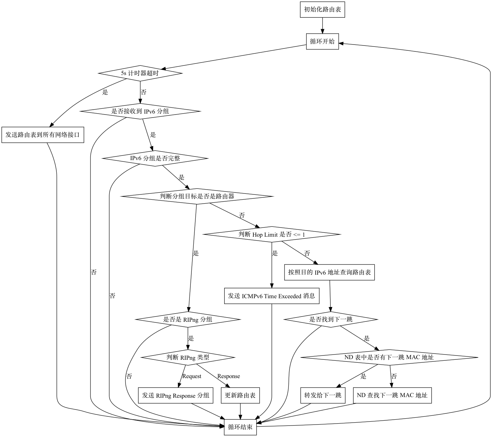

## RIPng 路由器

一个 RIPng 协议的路由器需要支持如下的功能：

1. 利用 RIPng 协议宣告和更新路由表
2. 按照动态的路由表，进行 IPv6 分组的转发

## 协议理解

在这一步，你需要实现一个 RIPng 协议的路由器。

你需要首先阅读 [RFC 2080](https://datatracker.ietf.org/doc/html/rfc2080)，并能回答下面的几个问题：

1. 数据格式是怎么样的？
2. UDP 端口号是？
3. IPv6 源地址是？目的地址是？
4. 接收到其他路由器的 RIPng 分组时，按照什么逻辑更新自己的路由表？
5. 如何表示路径无穷大？如何区分路径是因为不可达还是毒性反转产生的无穷大？
6. 如何实现水平分割（Split Horizon）？如何实现毒性反转（Split Horizon with Poisoned Reverse）？这两个是什么关系？

接着，阅读 [RFC 4443](https://datatracker.ietf.org/doc/html/rfc4443)，回答以下问题：

1. PING 命令是如何通过 ICMPv6 协议实现的？为了支持 PING，需要主机响应什么类型的 ICMPv6 分组？
2. ICMPv6 Echo Request 和 ICMPv6 Echo Reply 是如何对应起来的？
3. 路由器在什么时候会发送 Time Exceeded 和 Destination Unreachable 类型的消息？发送的 ICMPv6 分组中，IPv6 源地址，目的地址，Hop Limit，ICMPv6 的 Payload 分别是什么？

## 工作流程

可以回答以上几个问题以后，结合仓库中 `Homework/router/main.cpp` 尝试理解下面的路由的工作流程：

1. 初始化路由表，加入直连路由；
2. 进入路由器主循环；
3. 如果距离上一次发送已经超过了 5 秒，就发送完整的路由表到所有的接口；
4. 接收 IPv6 分组，如果没有收到就跳到第 2 步；
5. 检查 IPv6 分组的完整性和正确性；
6. 判断 IPv6 分组目标是否是路由器：如果是，则进入 RIPng 协议处理；如果否，则要转发；
7. 如果是 RIPng 分组，如果是 Request，就构造对应的 Response；如果是 Response，按照 Response 更新路由表；
8. 如果这个分组要转发，判断 Hop Limit，如果小于或等于 1，就回复 ICMPv6 Time Exceeded；
9. 如果 Hop Limit 正常，查询路由表，如果找到了，就转发给下一跳，转发时检查 ND 表；
10. 跳到第 2 步，进入下一次循环处理。

也可以见下面的流程图：

理解上面的工作流程后，尝试回答以下的问题：

1. 为什么要区分转发逻辑/RIPng/ICMPv6 逻辑？它们用途分别是什么？
2. 上面的步骤中，哪些步骤是性能瓶颈？

当你可以回答上面的问题的时候，就可以开始代码编写了。

## 功能要求

由于 RIPng/ICMPv6 协议完整实现比较复杂，我们只需要实现其中的一部分。必须实现的有：

1. 转发功能，支持直连路由和间接路由，包括 Hop Limit 减一，查表并向正确的 interface 发送出去。
2. 周期性地向所有端口发送 RIPng Response（**周期为 5s**，而不是 [RFC 2080 Section 2.3 Timers](https://www.rfc-editor.org/rfc/rfc2080.html#section-2.3) 要求的 30s），目标地址为 RIPng 的组播地址。
3. 对收到的 RIPng Request 生成 RIPng Response 进行回复，目标地址为 RIPng Request 的源地址。
4. 实现水平分割（split horizon）和毒性反转（reverse poisoning）。
5. 收到 RIPng Response 时，对路由表进行维护，处理 RIPng 中 `metric=16` 的情况。
6. 在 Hop Limit 减为 0 时，回复 ICMPv6 Time Exceeded (Hop limit exceeded in transit)，见 [RFC 4443 Section 3.3 Time Exceeded Message](https://datatracker.ietf.org/doc/html/rfc4443#section-3.3)。
7. 在发送的 RIPng Response 大小超过 MTU 时进行拆分。

可选实现的有（不加分，但对调试有帮助）：

1. 定期或者在更新的时候向 stdout/stderr 打印最新的 RIP 路由表。
2. 在路由表出现更新的时候立即发送 RIPng Response（完整或者增量），可以加快路由表的收敛速度。
3. 路由的超时（Timeout）和垃圾回收（Garbage Collection）定时器。
4. 程序启动时向所有 interface 发送 RIPng Request。
5. 对 ICMPv6 Echo Request 进行 ICMPv6 Echo Reply 的回复，见 [RFC 4443 Echo Reply Message](https://datatracker.ietf.org/doc/html/rfc4443#section-4.2)。
6. 在接受到 IPv6 packet，按照目的地址在路由表中查找不到路由的时候，回复 ICMPv6 Destination Unreachable (No route to destination)，见 [RFC 4443 Section 3.1 Destination Unreachable Message](https://datatracker.ietf.org/doc/html/rfc4443#section-3.1)。

不需要实现的有：

1. NDP 的处理，已经在 HAL 中实现。
2. interface 状态的跟踪（UP/DOWN 切换）。

!!! attention "HONOR CODE"

    在 `router` 目录中，有一个 `HONOR-CODE.md` 文件，你需要在这个文件中以 Markdown 格式记录你完成这个作业时参考网上的文章或者代码、与同学的交流情况。
