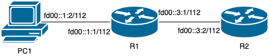

## 网络拓扑

在 TANLabs 提交后，会在实验室的实验网络下进行真机评测。你的软件会运行在树莓派上，和平台提供的机器组成如下的拓扑：



这一阶段，R1 由 TANLabs 自动配置和提供，你代码所运行在的树莓派处于 PC1 和 R2 的位置。其中 PC1 运行 TFTP 客户端，R2 运行 TFTP 服务端。

初始状态下，R2 配置如下的路由：

```
fd00::1:0/122 dev r1pc1 scope link
fd00::3:0/122 dev r1r2 scope link
```

## 检查内容

评测时 TANLabs 将会自动逐项检查下列内容：

1. 配置网络拓扑，在 R2 上运行标准 TFTP 服务器程序。
2. （15% 分数）测试你写的 TFTP 客户端从标准 TFTP 服务端下载文件，在 R2 上创建文件 `test2`，在 PC1 上运行 `client get fd00::3:2 test2`，判断 PC1 上 `test2` 内容是否与 R2 上一致。
3. （15% 分数）测试你写的 TFTP 客户端向标准 TFTP 服务端上传文件，在 PC1 上创建文件 `test3`，在 PC1 上运行 `client put fd00::3:2 test3`，判断 R2 上 `test3` 内容是否与 PC1 上一致。
4. 停止 R2 上的标准 TFTP 服务器，在 R2 上运行你写的 TFTP 服务端。
5. （15% 分数）测试标准 TFTP 客户端从你写的 TFTP 服务端下载文件，在 R2 上创建文件 `test5`，在 PC1 上运行 `echo "get test5" | tftp fd00::3:2`，判断 PC1 上 `test5` 内容是否与 R2 上一致。
6. （15% 分数）测试标准 TFTP 客户端向你写的 TFTP 服务端上传文件，在 PC1 上创建文件 `test6`，在 PC1 上运行 `echo "put test6" | tftp fd00::3:2`，判断 R2 上 `test6` 内容是否与 PC1 上一致。
7. （15% 分数）测试你写的 TFTP 客户端从你写的 TFTP 服务端下载文件，在 R2 上创建文件 `test7`，在 PC1 上运行 `client get fd00::3:2 test7`，判断 PC1 上 `test7` 内容是否与 R2 上一致。
8. （15% 分数）测试你写的 TFTP 客户端从你写的 TFTP 服务端上传文件，在 PC1 上创建文件 `test8`，在 PC1 上运行 `client put fd00::3:2 test8`，判断 R2 上 `test8` 内容是否与 PC1 上一致。
9. （10% 分数）测试你写的 TFTP 客户端从你写的 TFTP 服务端下载文件的性能（根据端到端 wall time 时间计算）

代码量：实现客户端约 170 行，实现服务端约 310 行。

设传输速度为 $s$，所有同学中传输速度最大值为 $s_{max}$，则性能分数 $S$ 为：

$$
S = S_{total} \times e^{c \times (s/s_{max}-1)}
$$

其中 $c$ 为未知常数。由于性能会计入分数，请在通过所有功能测试后，检查一下是否删除了不必要的影响性能的调试代码。

??? warning "容易出错的地方"

??? example "可供参考的例子"

??? tip "在线评测的原理"