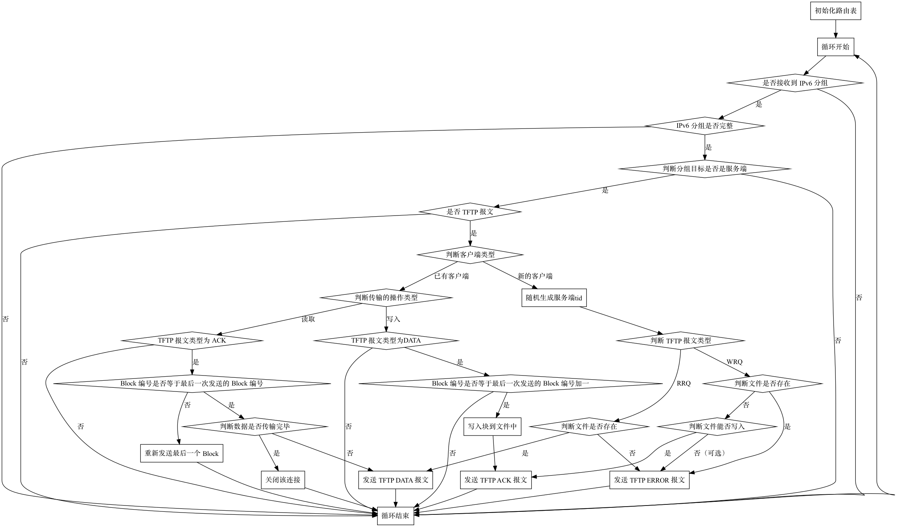

## TFTP 客户端和服务端

一个 TFTP 客户端需要支持如下的功能：

1. 指定服务器的 IPv6 地址，利用 TFTP 协议下载和上传文件

一个 TFTP 服务端需要支持如下的功能：

1. 处理 TFTP 客户端的上传和下载请求
2. 支持多个 TFTP 客户端同时发送请求

## 协议理解

在这一步，你需要实现一个 TFTP 协议的客户端和服务端。

在实现 TFTP 协议的时候，你需要首先阅读 [RFC 1350](https://www.rfc-editor.org/rfc/rfc1350)，理解 TFTP 协议的传输流程，以及 TFTP 的报文格式，注意写入文件和读取文件操作在流程上的相同与不同，回答以下几个问题：

1. TFTP 有哪几种类型的报文？
2. TFTP 的 UDP 端口号是多少？
3. 写入文件时，客户端需要发送哪些类型的 TFTP 报文，服务端需要发送哪些类型的 TFTP 报文？
4. 写入文件的时候，客户端如何告诉服务端文件已经发送完毕？
5. 读取文件时，客户端需要发送哪些类型的 TFTP 报文，服务端需要发送哪些类型的 TFTP 报文？
6. 读取文件的时候，服务端如何告诉客户端文件已经发送完毕？

为了让服务端能够支持多个 TFTP 客户端同时请求，你需要回答以下问题：

1. 如何区分一个 UDP 数据报来自已有的客户端，还来自新的客户端？
2. 如何为每个客户端维护当前状态？
3. 如何支持多个 TFTP 客户端同时请求？

## 工作流程

可以回答以上几个问题以后，结合仓库中  `Homework/tftp/server.cpp` 与  `Homework/tftp/client.cpp` 尝试理解 TFTP 服务端与客户端的工作流程。

### TFTP 服务端

TFTP 服务端的主要工作流程如下：

1. 初始化路由表，加入直连路由；
2. 进入主循环；
3. 接收 IPv6 分组，如果没有收到就跳到第 2 步；
4. 检查 IPv6 分组的完整性和正确性；
5. 判断 IPv6 分组目标是否是服务端：如果是，则进入 TFTP 协议处理；如果否，忽略并跳到第 2 步；
6. 如果 IPv6 分组来自新的 TFTP 客户端，为该客户端随机生成服务端 TID 并记录相关信息；
    1. 如果是 TFTP RRQ，文件不存在则构造 TFTP ERROR 并发送，文件存在则读取文件，构造 TFTP DATA 并发送文件第一个块，同时更新传输状态；
    2. 如果是 TFTP WRQ，文件存在则构造 TFTP ERROR 并发送，文件不存在则构造 TFTP ACK 并发送，告诉客户端可以开始发送文件内容，同时更新传输状态；
7. 如果 IPv6 分组来自已有的 TFTP 客户端
    1. 如果正在进行的传输的操作是读取且收到的为 TFTP ACK，则检查 Block 编号：
        1. 如果和最后一次发送的 Block 编号相等，说明客户端已经收到最后一次发送的 Block，根据当前传输状态，判断要继续发送下一个块，还是当前传输已经结束；
        2. 如果和最后一次发送的 Block 编号不相等，说明客户端没有收到最后一次发送的 Block，则要重新发送最后一次发送的 Block；
    2. 如果正在进行的传输的操作是写入且收到的为 TFTP DATA，则检查 Block 编号，若 Block 编号为最后一次传输的 Block 编号加一，说明客户端发送了新的块，则写入块到文件并发送 TFTP ACK；
8. 跳到第 2 步，进入下一次循环处理。

也可以见下面的流程图：

### TFTP 客户端

TFTP 客户端的工作流程如下：

1. 初始化路由表，加入直连路由；
2. 解析命令行参数；
3. 进入主循环；
4. 判断当前状态，初始状态下，根据命令行参数发送 TFTP RRQ 或者 WRQ；
3. 接收 IPv6 分组，如果没有收到就跳到第 3 步；
4. 检查 IPv6 分组的完整性和正确性；
5. 判断 IPv6 分组目标是否是客户端：如果是，则进入 TFTP 协议处理；如果否，忽略并跳到第 3 步；
6. 判断 UDP 目的端口是否等于客户端 TID，如果已知服务端 TID，则判断 UDP 源端口是否等于服务端 TID；如果不知道服务端 TID，例如在初始状态下，此时记录下服务端 TID，并更新传输状态；
7. 判断 TFTP 的 Opcode；
    1. 如果是 DATA，并且当前的传输是读取，那么检查 DATA 的 Block Number 是否等于最后一次传输的 Block Number 加一，如果是，则说明是新的数据，写入到文件中，同时发送 ACK 告诉服务器已收到这个块的数据，如果新的块大小不足 512，说明传输完成，可以退出程序；
    2. 如果是 ACK，并且当前的传输是写入，那么检查 ACK 的 Block Number 是否等于最后一次传输的 Block Number，如果是，则说明服务器已经收到最后一次传输的块，判断文件是否传输完毕，如果没传输完，则继续传输下一个块；如果不相等，说明最后一次传输的块没有传输成功，则重新发送最后一次传输的块；
8. 跳到第 2 步，进入下一次循环处理。

也可以见下面的流程图：

## 功能要求

由于协议完整实现比较复杂，你只需要实现其中的一部分。必须实现的有：

- TFTP 服务端：
    1. 对收到的 TFTP RRQ，若文件存在则生成 TFTP DATA 回复，则生成 TFTP ERROR 回复；
    2. 对收到的 TFTP WRQ，若文件不存在且可写入，则生成 TFTP ACK 回复，否则生成 TFTP ERROR 回复；
    3. 若正在进行的传输的操作为读取，对收到的 TFTP ACK，若 Block 编号等于最后一次发送的 Block 编号，则读取下一块并生成 TFTP DATA 回复，否则重新发送最后一个 Block；
    4. 若正在进行的传输的操作为写入，对收到的 TFTP DATA，若 Block 编号等于最后一次发送的 Block 编号加一，则写入块到文件中并生成 TFTP ACK 回复；
- TFTP 客户端：
    1. 对收到的 TFTP DATA，判断其 Block Number，写入数据到文件中，发送 TFTP ACK 回复；
    2. 对收到的 TFTP ACK，判断其 Block Number，发送下一块数据 TFTP DATA。

可选实现的有（不加分）：

- TFTP 服务端：
    1. 接收到 TFTP WRQ，但无法写入文件时，回复 TFTP ERROR；
    2. 若正在进行的传输的操作为写入，对收到的 TFTP DATA，若 Block 编号不等于最后一次发送的 Block 编号加一，则重新发送 TFTP ACK，告诉客户端需要重新传输 TFTP DATA；
    3. 除了 octet 以外的传输模式，如 netascii，都可以当成 octet 来实现。
- TFTP 客户端：
    1. 接受到 TFTP DATA，若 Block Number 不正确，则重新发送 TFTP ACK，高速服务端需要重新传输 TFTP DATA；
    2. 除了 octet 以外的传输模式，如 netascii，都可以当成 octet 来实现。

!!! attention "HONOR CODE"

    在 `tftp` 目录中，有一个 `HONOR-CODE.md` 文件，你需要在这个文件中以 Markdown 格式记录你完成这个作业时参考网上的文章或者代码、与同学的交流情况。

    HONOR CODE 可以在截止日期之后再提交到仓库中。
