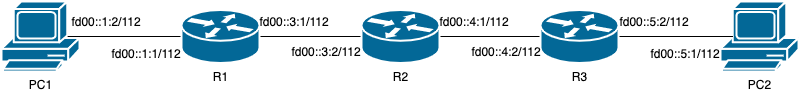

## 互联评测

第三部分是针对多人的互联测试，每次测试采用五位同学的代码，分别运行在五个网络设备上。为了完成互联评测，你需要使用同一份代码完成至少两次评测，且评测中其余四名同学不能出现重复，即共挑选八名同学，将你的代码分别与前四名和后四名同学联网进行评测。

最后，你需要在 TANLabs 上标记 master 分支上的最终版本，以及该版本的代码的两次评测记录，要求评测中其他同学不出现重复。

评测的网络拓扑如下：



- PC1: 运行第一名同学的 TFTP 客户端
- R1: 运行第二名同学的 DHCPv6 路由器
- R2: 运行第三名同学的 OSPF 或 RIPng 路由器
- R3: 运行第四名同学的 OSPF 或 RIPng 路由器
- PC2: 运行第五名同学的 TFTP 服务器

其中 R2 和 R3 同时运行 OSPF 协议或同时运行 RIPng 协议。

其中 R2 除了直连路由以外，还需要添加一条静态路由：

```
fd00::1:0/112 via fd00::3:1 dev r2r1
```

同时 PC1 初始情况下没有 IPv6 地址和路由，需要通过 DHCPv6 协议获取。

## 评测方法

评测方法：

1. 配置网络拓扑，在 R1 R2 R3 PC2 上分别运行后四位同学的程序；
2. （20% 分数）在 PC1 上运行 `dhcpcd -6 -1 -B -C resolv.conf -d pc1r1` 命令获取动态 IPv6 地址，如果没有分配成功，则跳过以下测试项目，直接记为失败；
3. 等待 RIPng 协议运行一段时间，一分钟后进行评测。
4. （20% 分数）在 PC1 上 `ping fd00::3:2` 若干次，测试 ICMP 连通性。
5. （20% 分数）在 PC1 上 `ping fd00::5:1 -t 3`，应当出现 `Time Exceeded` 的 ICMPv6 响应。
6. （15% 分数）测试第一位同学写的 TFTP 客户端从第五位同学写的 TFTP 服务端下载文件，在 PC2 上创建文件 `test6`，在 PC1 上运行 `client get fd00::5:1 test6`，判断 PC1 上 `test6` 内容是否与 PC2 上一致。
7. （15% 分数）测试第一位同学写的 TFTP 客户端向第五位同学写的 TFTP 服务端上传文件，在 PC1 上创建文件 `test7`，在 PC1 上运行 `client put fd00::5:1 test7`，判断 PC2 上 `test7` 内容是否与 PC1 上一致。
8. （10% 分数）测试第一位同学写的 TFTP 客户端向第五位同学写的 TFTP 服务端下载文件的性能（根据端到端 wall time 时间计算）

由于性能会计入分数，请在通过所有功能测试后，检查一下是否删除了不必要的影响性能的调试代码。

??? warning "容易出错的地方"

	1. 没有把实验框架最新的更改同步到仓库，导致仓库中缺少对于互联测试的支持；
	2. 合并实验框架新修改的时候，不小心删掉了一些内容；
	3. 注意实验框架新的更改中，也是有 TODO 的，请注意实现。


??? tip "提升转发性能的方法"


??? tip "支持较大路由表的方法"


!!! tips "第三阶段实验是怎么设计出来的？"


## 本地测试

在进行互联测试的时候，可以在本机搭建一个虚拟的和评测一样的网络拓扑，这样就可以在虚拟网络中按照评测流程一步一步进行，同时观察程序的行为，可以大大地加快代码的调试。

本地测试主要分为两个部分：首先，搭建网络拓扑，将网络中各个设备连接好；其次，在各个设备上，运行相应的软件，并配置好网络。

下面涉及到的脚本都在 `Setup/interconnect` 目录下。

下面分为两种方法来进行测试：

1. 在互联测试的拓扑中，测试自己编写的代码
2. 集齐三到五位同学的程序，放在一台机器上测试

### 仅测试自己的代码

如果在互联测试的拓扑中，仅测试自己编写的代码，按照下面的分情况来测试：

#### PC1 上的 TFTP 客户端

自己编写的代码是 `Homework/tftp/pc1/client`，此时 R1 R2 R3 PC2 运行标准程序。

0. 确认系统内没有正在运行的 TFTP 客户端和服务端（进程名为 client/server）以及 bird 程序（进程名为 bird 或者 bird6）以及 dhcpcd 进程。
1. 进入 `Setup/interconnect/setup` 目录，运行 `sudo ./setup-netns.sh` 命令以配置网络拓扑。
2. 进入 `Setup/interconnect/setup` 目录，运行 `sudo ./start-standard-r1-dhcpd.sh`，在 R1 上启动标准 DHCPv6 服务器。
3. 打开新窗口，进入 `Setup/interconnect/setup` 目录，运行 `sudo ./start-standard-r1-radvd.sh`，在 R1 上启动标准 IPv6 RA 服务器。
4. 打开新窗口，进入 `Setup/interconnect/setup` 目录，根据 BIRD 版本，进入 bird-v1 或 bird-v2 目录，然后运行 `sudo ./bird-r2.sh` 或 `sudo ./bird-r2-v2.sh`，在 R2 上启动标准 RIPng 服务器。
5. 打开新窗口，进入 `Setup/interconnect/setup` 目录，根据 BIRD 版本，进入 bird-v1 或 bird-v2 目录，然后运行 `sudo ./bird-r3.sh` 或 `sudo ./bird-r3-v2.sh`，在 R3 上启动标准 RIPng 服务器。
6. 打开新窗口，进入 `Setup/interconnect/setup` 目录，运行 `sudo ./start-standard-pc2.sh`，在 PC2 上启动标准 TFTP 服务器。
7. 打开新窗口，进入 `Setup/interconnect/test` 目录，依次执行 `sudo ./test2.sh`、`sudo ./test4.sh`、`sudo ./test5.sh`、`sudo ./test6.sh`、`sudo ./test7.sh` 和 `sudo ./test8.sh`，完成各项测试。

#### R1 上的 DHCPv6 路由器

自己编写的代码是 `Homework/dhcpv6/r1/router`，此时 PC1 R2 R3 PC2 运行标准程序。

0. 确认系统内没有正在运行的 DHCPv6 路由器（进程名为 router）以及 bird 程序（进程名为 bird 或者 bird6）以及 dhcpcd 进程。
1. 进入 `Setup/interconnect/setup` 目录，运行 `sudo ./setup-netns.sh` 命令以配置网络拓扑。
2. 打开新窗口，进入 `Setup/interconnect/setup` 目录，运行 `sudo ./start-custom-r1.sh`，在 R1 上启动自己编写的 DHCPv6 服务器。
3. 打开新窗口，进入 `Setup/interconnect/setup` 目录，根据 BIRD 版本，进入 bird-v1 或 bird-v2 目录，然后运行 `sudo ./bird-r2.sh` 或 `sudo ./bird-r2-v2.sh`，在 R2 上启动标准 RIPng 服务器。
4. 打开新窗口，进入 `Setup/interconnect/setup` 目录，根据 BIRD 版本，进入 bird-v1 或 bird-v2 目录，然后运行 `sudo ./bird-r3.sh` 或 `sudo ./bird-r3-v2.sh`，在 R3 上启动标准 RIPng 服务器。
5. 打开新窗口，进入 `Setup/interconnect/setup` 目录，运行 `sudo ./start-standard-pc2.sh`，在 PC2 上启动标准 TFTP 服务器。
6. 打开新窗口，进入 `Setup/interconnect/test` 目录，依次执行 `sudo ./test2.sh`、`sudo ./test4.sh`、`sudo ./test5.sh`、`sudo ./test6-standard.sh`、`sudo ./test7-standard.sh` 和 `sudo ./test8-standard.sh`，完成各项测试。

#### R2 上的 RIPng 路由器

自己编写的代码是 `Homework/router/interconnect-r2/router`，此时 PC1 R1 R3 PC2 运行标准程序。

0. 确认系统内没有正在运行的 RIPng 路由器（进程名为 router）以及 bird 程序（进程名为 bird 或者 bird6）以及 dhcpcd 进程。
1. 进入 `Setup/interconnect/setup` 目录，运行 `sudo ./setup-netns.sh` 命令以配置网络拓扑。
2. 进入 `Setup/interconnect/setup` 目录，运行 `sudo ./start-standard-r1-dhcpd.sh`，在 R1 上启动标准 DHCPv6 服务器。
3. 打开新窗口，进入 `Setup/interconnect/setup` 目录，运行 `sudo ./start-standard-r1-radvd.sh`，在 R1 上启动标准 IPv6 RA 服务器。
4. 打开新窗口，进入 `Setup/interconnect/setup` 目录，运行 `sudo ./start-custom-r2.sh`，在 R2 上自己写的 RIPng 路由器。
5. 打开新窗口，进入 `Setup/interconnect/setup` 目录，根据 BIRD 版本，进入 bird-v1 或 bird-v2 目录，然后运行 `sudo ./bird-r3.sh` 或 `sudo ./bird-r3-v2.sh`，在 R3 上启动标准 RIPng 服务器。
6. 打开新窗口，进入 `Setup/interconnect/setup` 目录，运行 `sudo ./start-standard-pc2.sh`，在 PC2 上启动标准 TFTP 服务器。
7. 打开新窗口，进入 `Setup/interconnect/test` 目录，依次执行 `sudo ./test2.sh`、`sudo ./test4.sh`、`sudo ./test5.sh`、`sudo ./test6-standard.sh`、`sudo ./test7-standard.sh` 和 `sudo ./test8-standard.sh`，完成各项测试。

#### R2 上的 OSPF 路由器

施工中

#### R3 上的 RIPng 路由器

自己编写的代码是 `Homework/router/r3/router`，此时 PC1 R1 R2 PC2 运行标准程序。

0. 确认系统内没有正在运行的 RIPng 路由器（进程名为 router）以及 bird 程序（进程名为 bird 或者 bird6）以及 dhcpcd 进程。
1. 进入 `Setup/interconnect/setup` 目录，运行 `sudo ./setup-netns.sh` 命令以配置网络拓扑。
2. 进入 `Setup/interconnect/setup` 目录，运行 `sudo ./start-standard-r1-dhcpd.sh`，在 R1 上启动标准 DHCPv6 服务器。
3. 打开新窗口，进入 `Setup/interconnect/setup` 目录，运行 `sudo ./start-standard-r1-radvd.sh`，在 R1 上启动标准 IPv6 RA 服务器。
4. 打开新窗口，进入 `Setup/interconnect/setup` 目录，根据 BIRD 版本，进入 bird-v1 或 bird-v2 目录，然后运行 `sudo ./bird-r2.sh` 或 `sudo ./bird-r2-v2.sh`，在 R2 上启动标准 RIPng 服务器。
5. 打开新窗口，进入 `Setup/interconnect/setup` 目录，运行 `sudo ./start-custom-r3.sh`，在 R3 上自己写的 RIPng 路由器。
6. 打开新窗口，进入 `Setup/interconnect/setup` 目录，运行 `sudo ./start-standard-pc2.sh`，在 PC2 上启动标准 TFTP 服务器。
7. 打开新窗口，进入 `Setup/interconnect/test` 目录，依次执行 `sudo ./test2.sh`、`sudo ./test4.sh`、`sudo ./test5.sh`、`sudo ./test6-standard.sh`、`sudo ./test7-standard.sh` 和 `sudo ./test8-standard.sh`，完成各项测试。

#### R3 上的 OSPF 路由器

施工中

#### PC2 上的 TFTP 服务端

自己编写的代码是 `Homework/tftp/pc2/server`，此时 PC1 R1 R2 R3 运行标准程序。

0. 确认系统内没有正在运行的 TFTP 客户端和服务端（进程名为 client/server）以及 bird 程序（进程名为 bird 或者 bird6）以及 dhcpcd 进程。
1. 进入 `Setup/interconnect/setup` 目录，运行 `sudo ./setup-netns.sh` 命令以配置网络拓扑。
2. 进入 `Setup/interconnect/setup` 目录，运行 `sudo ./start-standard-r1-dhcpd.sh`，在 R1 上启动标准 DHCPv6 服务器。
3. 打开新窗口，进入 `Setup/interconnect/setup` 目录，运行 `sudo ./start-standard-r1-radvd.sh`，在 R1 上启动标准 IPv6 RA 服务器。
4. 打开新窗口，进入 `Setup/interconnect/setup` 目录，根据 BIRD 版本，进入 bird-v1 或 bird-v2 目录，然后运行 `sudo ./bird-r2.sh` 或 `sudo ./bird-r2-v2.sh`，在 R2 上启动标准 RIPng 服务器。
5. 打开新窗口，进入 `Setup/interconnect/setup` 目录，根据 BIRD 版本，进入 bird-v1 或 bird-v2 目录，然后运行 `sudo ./bird-r3.sh` 或 `sudo ./bird-r3-v2.sh`，在 R3 上启动标准 RIPng 服务器。
6. 打开新窗口，进入 `Setup/interconnect/setup` 目录，运行 `sudo ./start-custom-pc2.sh`，在 PC2 上启动自己写的 TFTP 服务器。
7. 打开新窗口，进入 `Setup/interconnect/test` 目录，依次执行 `sudo ./test2.sh`、`sudo ./test4.sh`、`sudo ./test5.sh`、`sudo ./test6-standard.sh`、`sudo ./test7-standard.sh` 和 `sudo ./test8-standard.sh`，完成各项测试。

### 测试多份程序

如果要测试多个同学的程序，先把多个同学编译好的程序集中到一个 Linux 系统的同一个仓库中。每个位置要执行的程序路径是：

- PC1: `Homework/tftp/pc1/client`
- R1: `Homework/dhcpv6/r1/router`
- R2: `Homework/router/interconnect-r2/router`
- R3: `Homework/router/r3/router`
- PC2: `Homework/tftp/pc2/server`

请注意不要复制代码。需要注意的是，编译的程序可能会有兼容性问题，例如通常在比较新的系统中编译的软件，无法直接在旧的系统中运行，报错可能是缺少相应的动态库，或者找不到 GLIBC 对应版本的符号。为了解决这个问题，可以在 Makefrag 中添加静态链接的编译选项。

准备好程序以后，按照下面的步骤评测：

1. 进入 `Setup/interconnect/setup` 目录，运行 `sudo ./setup-netns.sh` 命令以配置网络拓扑。
2. 进入 `Setup/interconnect/setup` 目录，运行 `sudo ./start-custom-r1.sh`，在 R1 上启动自己的 DHCPv6 服务器。
3. 打开新窗口，进入 `Setup/interconnect/setup` 目录，运行 `sudo ./start-custom-r2.sh`，在 R2 上启动自己的 RIPng 服务器。
4. 打开新窗口，进入 `Setup/interconnect/setup` 目录，运行 `sudo ./start-custom-r3.sh`，在 R3 上启动自己的 RIPng 服务器。
6. 打开新窗口，进入 `Setup/interconnect/setup` 目录，运行 `sudo ./start-custom-pc2.sh`，在 PC2 上启动自己写的 TFTP 服务器。
7. 打开新窗口，进入 `Setup/interconnect/test` 目录，依次执行 `sudo ./test2.sh`、`sudo ./test4.sh`、`sudo ./test5.sh`、`sudo ./test6.sh`、`sudo ./test7.sh` 和 `sudo ./test8.sh`，完成各项测试。
