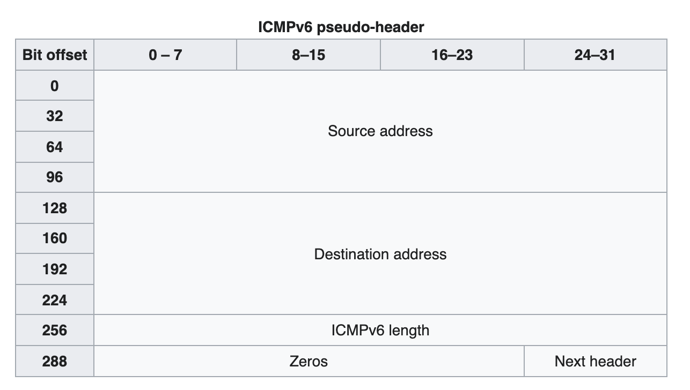

# 维基百科

考虑到部分同学访问英文维基百科可能有一些困难，把实验中可能会访问的一些页面的部分截图和文本放在这里，以供大家参考。

这一部分内容的许可证与维基百科一致：Creative Commons Attribution-ShareAlike

## IPv6 Header

[原网页](https://en.wikipedia.org/wiki/IPv6_packet)

- Version (4 bits)

The constant 6 (bit sequence 0110).

- Traffic Class (6+2 bits)

The bits of this field hold two values. The six most-significant bits hold the differentiated services field (DS field), which is used to classify packets.[2][3] Currently, all standard DS fields end with a '0' bit. Any DS field that ends with two '1' bits is intended for local or experimental use.[4]
The remaining two bits are used for Explicit Congestion Notification (ECN);[5] priority values subdivide into ranges: traffic where the source provides congestion control and non-congestion control traffic.

- Flow Label (20 bits)

A high-entropy identifier of a flow of packets between a source and destination. A flow is a group of packets, e.g., a TCP session or a media stream. The special flow label 0 means the packet does not belong to any flow (using this scheme). An older scheme identifies flow by source address and port, destination address and port, protocol (value of the last Next Header field).[6] It has further been suggested that the flow label be used to help detect spoofed packets.[7]

- Payload Length (16 bits)

The size of the payload in octets, including any extension headers. The length is set to zero when a Hop-by-Hop extension header carries a Jumbo Payload option.[8]

- Next Header (8 bits)

Specifies the type of the next header. This field usually specifies the transport layer protocol used by a packet's payload. When extension headers are present in the packet this field indicates which extension header follows. The values are shared with those used for the IPv4 protocol field, as both fields have the same function (see List of IP protocol numbers).

- Hop Limit (8 bits)

Replaces the time to live field in IPv4. This value is decremented by one at each forwarding node and the packet is discarded if it becomes 0. However, the destination node should process the packet normally even if received with a hop limit of 0.

- Source Address (128 bits)

The unicast IPv6 address of the sending node.

- Destination Address (128 bits)

The IPv6 unicast or multicast address of the destination node(s).
In order to increase performance, and since current link layer technology and transport layer protocols are assumed to provide sufficient error detection,[9] the header has no checksum to protect it.[1]

## UDP Header

[原网页](https://en.wikipedia.org/wiki/User_Datagram_Protocol)

A UDP datagram consists of a datagram header and a data section. The UDP datagram header consists of 4 fields, each of which is 2 bytes (16 bits).[1] The data section follows the header and is the payload data carried for the application.

The use of the checksum and source port fields is optional in IPv4 (pink background in table). In IPv6 only the source port field is optional.

- Source port number

This field identifies the sender's port, when used, and should be assumed to be the port to reply to if needed. If not used, it should be zero. If the source host is the client, the port number is likely to be an ephemeral port number. If the source host is the server, the port number is likely to be a well-known port number.[4]

- Destination port number

This field identifies the receiver's port and is required. Similar to source port number, if the client is the destination host then the port number will likely be an ephemeral port number and if the destination host is the server then the port number will likely be a well-known port number.[4]

- Length

This field specifies the length in bytes of the UDP header and UDP data. The minimum length is 8 bytes, the length of the header. The field size sets a theoretical limit of 65,535 bytes (8-byte header + 65,527 bytes of data) for a UDP datagram. However the actual limit for the data length, which is imposed by the underlying IPv4 protocol, is 65,507 bytes (65,535 bytes − 8-byte UDP header − 20-byte IP header).[5]

Using IPv6 jumbograms it is possible to have UDP datagrams of size greater than 65,535 bytes.[6] RFC 2675 specifies that the length field is set to zero if the length of the UDP header plus UDP data is greater than 65,535.

- Checksum

The checksum field may be used for error-checking of the header and data. This field is optional in IPv4, and mandatory in IPv6.[7] The field carries all-zeros if unused.[8]

## IPv6 pseudo header for UDP

[原网页](https://en.wikipedia.org/wiki/User_Datagram_Protocol)

When UDP runs over IPv6, the checksum is mandatory. The method used to compute it is changed as documented in RFC 2460:

Any transport or other upper-layer protocol that includes the addresses from the IP header in its checksum computation must be modified for use over IPv6 to include the 128-bit IPv6 addresses.[7]

When computing the checksum, again a pseudo header is used that mimics the real IPv6 header:

The source address is the one in the IPv6 header. The destination address is the final destination; if the IPv6 packet does not contain a Routing header, that will be the destination address in the IPv6 header; otherwise, at the originating node, it will be the address in the last element of the Routing header, and, at the receiving node, it will be the destination address in the IPv6 header. The value of the Next Header field is the protocol value for UDP: 17. The UDP length field is the length of the UDP header and data.

## ICMPv6 packet

[原网页](https://en.wikipedia.org/wiki/Internet_Control_Message_Protocol_for_IPv6)

The ICMPv6 message consists of a header and the protocol payload. The header contains only three fields: type (8 bits), code (8 bits), and checksum (16 bits). type specifies the type of the message. Values in the range from 0 to 127 (high-order bit is 0) indicate an error message, while values in the range from 128 to 255 (high-order bit is 1) indicate an information message. The code field value depends on the message type and provides an additional level of message granularity. The checksum field provides a minimal level of integrity verification for the ICMP message.

## IPv6 pseudo header for ICMPv6

[原网页](https://en.wikipedia.org/wiki/Internet_Control_Message_Protocol_for_IPv6)

ICMPv6 provides a minimal level of message integrity verification by the inclusion of a 16-bit checksum in its header. The checksum is calculated starting with a pseudo-header of IPv6 header fields according to the IPv6 standard,[3] which consists of the source and destination addresses, the packet length and the next header field, the latter of which is set to the value 58. Following this pseudo header, the checksum is continued with the ICMPv6 message. The checksum computation is performed according to Internet protocol standards using 16-bit ones' complement summation, followed by a final ones' complement of the checksum itself and inserting it into the checksum field.[4] Note that this differs from the way it is calculated for IPv4 in ICMP, but is similar to the calculation done in TCP.
